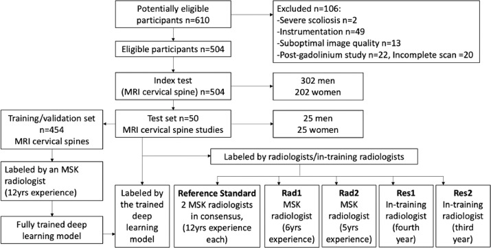

# Deep learning model for automated diagnosis of degenerative cervical spondylosis and altered spinal cord signal on MRI

Codes for NUH MRI cervical spine project:

[The Spine Journal](https://www.sciencedirect.com/science/article/pii/S1529943024010386)  

## Dependencies

* CUDA 10.2
* Python 3.8
* PyTorch 1.8
* TorchVision 0.82

## Framework

<p align="middle">

</p>

## Experiment

### Setup
Prepare the dataset in the COCO format for detection:

```
path/to/dataset/
  annotations/  # annotation json files dir
    train.json  # annotation json for train images
    val.json    # annotaiton json for val images
  train/        # train images
  val/          # val images
```

### Bounding Box Detection

```
cd cord-signal
```

**Train:**

```
python -m torch.distributed.launch --nproc_per_node=NumberOfGPUForTrain
       --use_env main_pretrained.py 
       --test_dataset TestDataset 
       --backbone BackboneName(resnet50|resnet101)
       --num_queries EstimatedBoxInOneImage
       --resume /path/to/pretrained/model 
       --output_dir /path/to/store/checkpoint
       --num_classes NumberOfClasses
       --coco_path /path/to/dataset
```

*Models for resume:*

* [backbone_transformer\_r50.pth ](https://drive.google.com/file/d/16YgMNbnrB9iifxnSWK2Ws4ioBBrnF2pl/view?usp=sharing)
* [backbone\_transformer\_r50\_dc5.pth](https://drive.google.com/file/d/1Qt7L4DjMBuk4ErJRDIb1Ta5kgVqOLFfy/view?usp=sharing)
* [backbone\_transformer\_r101.pth](https://drive.google.com/file/d/1TE5swpuoknxQ6LVUHclBTVg3NtFEQDee/view?usp=sharing)
* [backbone\_transformer\_r101\_dc5.pth](https://drive.google.com/file/d/1ExEnKz3Zo9H1iYI5sbDFOOzGHmSEz_Te/view?usp=sharing)


**Eval:**

```
python main_pretrained.py 
    --batch_size BatchSize 
    --no_aux_loss 
    --eval 
    --backbone BackboneName
    --num_queries EstimatedBoxInOneImage
    --coco_path /path/to/dataset
    --test_dataset TestDatasetDifferentFromTheCocoPathOne
    --output_dir /path/to/store/results
```	
		
**Result Analysis:**

Open the jupyter notebook to conduct result analysis from the results generated from above Eval.

Example on Axail image:

```
result_analysis.ipynb
```


## Citation


```BibTex
@article{lee2024deep,
  title={Deep learning model for automated diagnosis of degenerative cervical spondylosis and altered spinal cord signal on MRI},
  author={Lee, Aric and Wu, Junran and Liu, Changshuo and Makmur, Andrew and Ting, Yong Han and Nor, Faimee Erwan Muhamat and Tan, Loon Ying and Ong, Wilson and Tan, Wei Chuan and Lee, You Jun and others},
  journal={The Spine Journal},
  year={2024},
  publisher={Elsevier}
}
```
